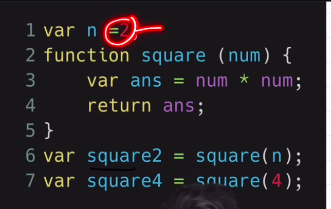

## Complete Javascript

Execution ContextEverything in javascript happens in execution context, execution context can be imagined as a big box having 2 component:

1. Memory component - Variable Environment
2. Code - Thread of execution

### Single Threaded and Synchronous i.e. one command at a time

 

### What happens when we run a Javascript program ?

1. Execution context is created, memory is allocated to variables and functions, where function contains all the code and variables are initialized by a special keyword called “undefined“
2. When function is called/invoked again a new execution context is created and memory is allocated save as above
3. This process will continue till an another/same function is called within the function

4. n over here is know as arguement and num is known as parameters, these 2 terminologies are different often used as alternatives
5. once function execution is finished, the control will return back to the calling line and
   execution context will be deleted
6. all execution contexts are placed on CallStack , local execution contexts will be poped out of it as needed but, global context will be popped out at the end
7. Fancy name for CallStack - Control stack, runtime stack, machine stack
